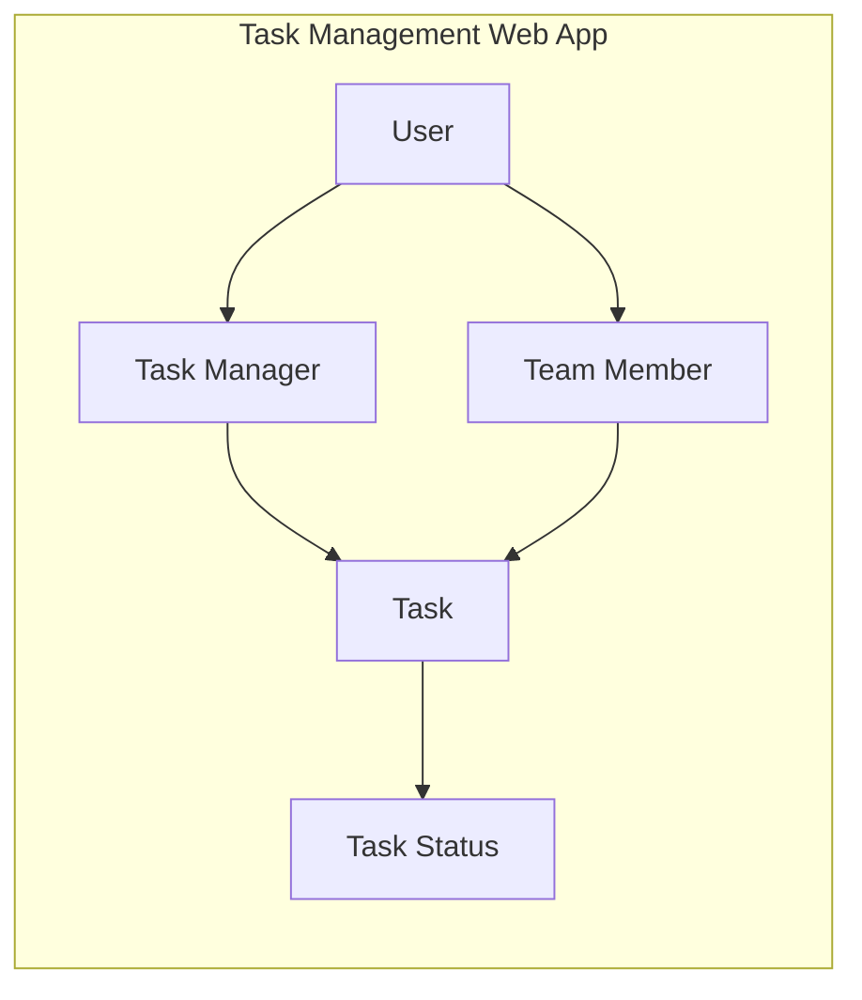
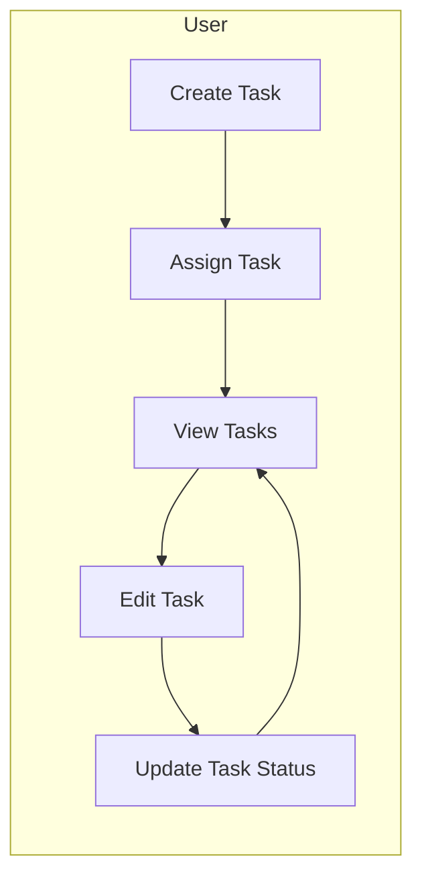
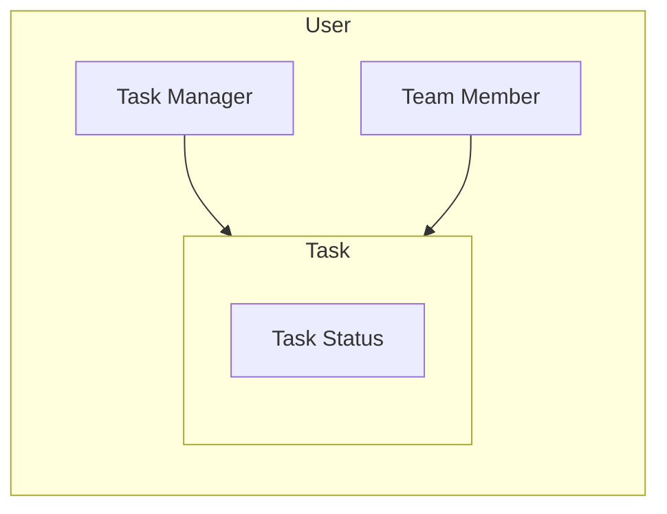

## C4-Style Context

The following is a C4-style context diagram for the task management web app:

In this diagram, we can see that the system consists of three main components: User, Task Manager, and Team Member. The User component represents the users who will be using the app to manage their tasks. The Task Manager component represents the user who is responsible for managing tasks and ensuring they are completed on time. The Team Member component represents the users who are part of a team and need to collaborate with others on task management.

The Task component represents the tasks that will be managed by the system. Each task has a status, which can be one of the following: "To Do", "In Progress", or "Completed". The Task Status component represents the different states that a task can be in.

## Components

The following is a list of components for the task management web app:

1. User: This component represents the users who will be using the app to manage their tasks. It has the following attributes:
	* id (unique identifier)
	* name
	* email
	* password
2. Task Manager: This component represents the user who is responsible for managing tasks and ensuring they are completed on time. It has the following attributes:
	* id (unique identifier)
	* name
	* email
	* password
3. Team Member: This component represents the users who are part of a team and need to collaborate with others on task management. It has the following attributes:
	* id (unique identifier)
	* name
	* email
	* password
4. Task: This component represents the tasks that will be managed by the system. It has the following attributes:
	* id (unique identifier)
	* title
	* description
	* due date
	* status (one of "To Do", "In Progress", or "Completed")
5. Task Status: This component represents the different states that a task can be in. It has the following attributes:
	* id (unique identifier)
	* name (e.g., "To Do", "In Progress", or "Completed")

## Sequence for Key Flows

The following is a sequence diagram for the key flows in the system:

In this sequence diagram, we can see that the user creates a new task and assigns it to other users. The user then views their tasks and edits them as needed. Finally, the user updates the status of the task to "Completed".

## API Spec Outline

The following is an outline of the APIs for the task management web app:

1. User API:
	* POST /users: Create a new user
	* GET /users/{id}: Retrieve a specific user by ID
	* PUT /users/{id}: Update a specific user by ID
	* DELETE /users/{id}: Delete a specific user by ID
2. Task API:
	* POST /tasks: Create a new task
	* GET /tasks: Retrieve all tasks
	* GET /tasks/{id}: Retrieve a specific task by ID
	* PUT /tasks/{id}: Update a specific task by ID
	* DELETE /tasks/{id}: Delete a specific task by ID
3. Task Status API:
	* POST /task-statuses: Create a new task status
	* GET /task-statuses: Retrieve all task statuses
	* GET /task-statuses/{id}: Retrieve a specific task status by ID
	* PUT /task-statuses/{id}: Update a specific task status by ID
	* DELETE /task-statuses/{id}: Delete a specific task status by ID
4. Task Assignment API:
	* POST /task-assignments: Create a new task assignment
	* GET /task-assignments: Retrieve all task assignments
	* GET /task-assignments/{id}: Retrieve a specific task assignment by ID
	* PUT /task-assignments/{id}: Update a specific task assignment by ID
	* DELETE /task-assignments/{id}: Delete a specific task assignment by ID

## Data Model

The following is a data model for the task management web app:

In this data model, we can see that a user has many tasks and a task has one status. A task status represents the different states that a task can be in.

## Tradeoffs

The following are some tradeoffs for the task management web app:

1. Scalability: The system should be scalable and able to handle a large number of users. This means that we need to use a distributed database and design the system to be highly available.
2. Security: The system should be secure and protect user data. This means that we need to use encryption, secure authentication, and other security measures to protect against unauthorized access.
3. Performance: The system should be performant and able to handle a large number of requests per second. This means that we need to use caching, load balancing, and other performance optimization techniques to improve the system's overall performance.
4. Maintainability: The system should be easy to maintain and update. This means that we need to use modular design patterns, version control, and other maintenance techniques to make it easier to update and maintain the system over time.