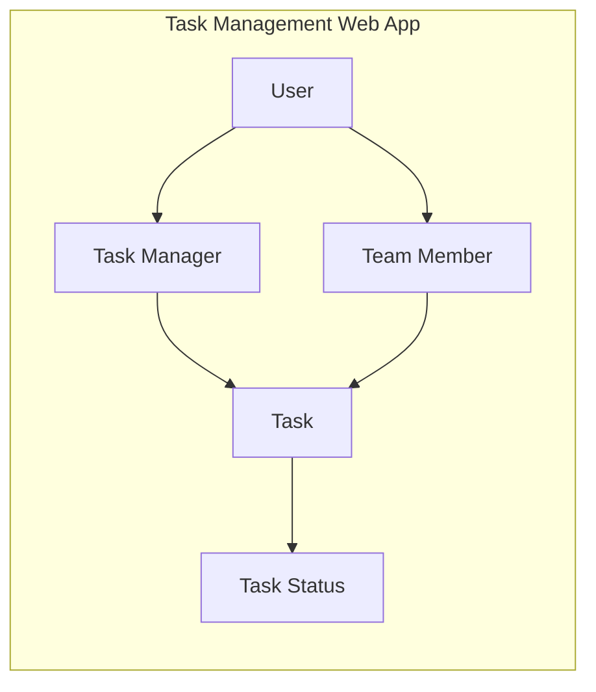
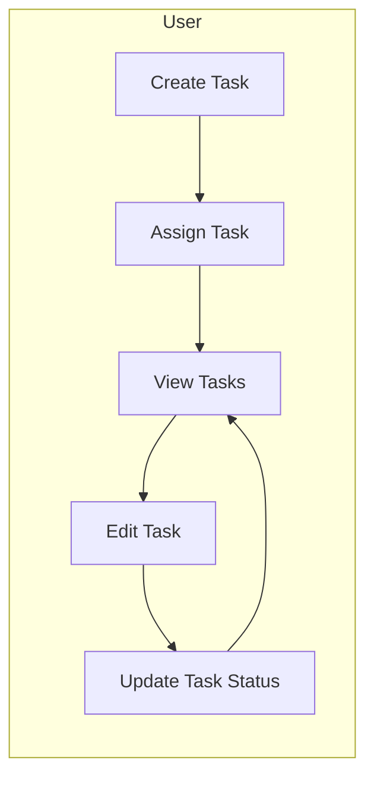
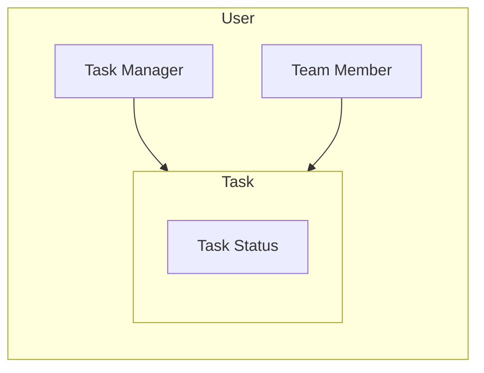

# Spec

Build a simple task management web app with backend in Go and frontend in React.


# 01-Product Output (generated in 1m53.069s)


Problem Statement:
The goal of this project is to build a simple task management web app that allows users to create, assign, and track tasks. The app should be easy to use and have a clean interface.

Personas:

1. Task Manager: A user who is responsible for managing tasks and ensuring they are completed on time.
2. Team Member: A user who is part of a team and needs to collaborate with others on task management.
3. User: A general user who wants to use the app to manage their personal tasks.

Top 5 User Stories (As a … I want … so that …):

1. As a Task Manager, I want to be able to create new tasks and assign them to team members so that I can ensure they are completed on time.
2. As a Team Member, I want to be able to view and edit my assigned tasks so that I can complete them efficiently.
3. As a User, I want to be able to view my personal tasks and prioritize them so that I can manage my workload effectively.
4. As a Task Manager, I want to be able to track the progress of my team members' tasks so that I can ensure they are making progress towards their goals.
5. As a Team Member, I want to be able to communicate with my team members about tasks and deadlines so that we can collaborate effectively.

Acceptance Criteria:

1. The app should allow users to create new tasks and assign them to other users.
2. The app should allow users to view and edit their assigned tasks.
3. The app should allow users to view their personal tasks and prioritize them.
4. The app should allow users to track the progress of their team members' tasks.
5. The app should allow users to communicate with their team members about tasks and deadlines.

Non-Functional Requirements:

1. The app should be easy to use and have a clean interface.
2. The app should be scalable and able to handle a large number of users.
3. The app should be secure and protect user data.
4. The app should be accessible from any device with an internet connection.
5. The app should be compatible with modern web browsers.


# 02-Design Output (generated in 5m46.117s)


## C4-Style Context

The following is a C4-style context diagram for the task management web app:

In this diagram, we can see that the system consists of three main components: User, Task Manager, and Team Member. The User component represents the users who will be using the app to manage their tasks. The Task Manager component represents the user who is responsible for managing tasks and ensuring they are completed on time. The Team Member component represents the users who are part of a team and need to collaborate with others on task management.

The Task component represents the tasks that will be managed by the system. Each task has a status, which can be one of the following: "To Do", "In Progress", or "Completed". The Task Status component represents the different states that a task can be in.

## Components

The following is a list of components for the task management web app:

1. User: This component represents the users who will be using the app to manage their tasks. It has the following attributes:
	* id (unique identifier)
	* name
	* email
	* password
2. Task Manager: This component represents the user who is responsible for managing tasks and ensuring they are completed on time. It has the following attributes:
	* id (unique identifier)
	* name
	* email
	* password
3. Team Member: This component represents the users who are part of a team and need to collaborate with others on task management. It has the following attributes:
	* id (unique identifier)
	* name
	* email
	* password
4. Task: This component represents the tasks that will be managed by the system. It has the following attributes:
	* id (unique identifier)
	* title
	* description
	* due date
	* status (one of "To Do", "In Progress", or "Completed")
5. Task Status: This component represents the different states that a task can be in. It has the following attributes:
	* id (unique identifier)
	* name (e.g., "To Do", "In Progress", or "Completed")

## Sequence for Key Flows

The following is a sequence diagram for the key flows in the system:

In this sequence diagram, we can see that the user creates a new task and assigns it to other users. The user then views their tasks and edits them as needed. Finally, the user updates the status of the task to "Completed".

## API Spec Outline

The following is an outline of the APIs for the task management web app:

1. User API:
	* POST /users: Create a new user
	* GET /users/{id}: Retrieve a specific user by ID
	* PUT /users/{id}: Update a specific user by ID
	* DELETE /users/{id}: Delete a specific user by ID
2. Task API:
	* POST /tasks: Create a new task
	* GET /tasks: Retrieve all tasks
	* GET /tasks/{id}: Retrieve a specific task by ID
	* PUT /tasks/{id}: Update a specific task by ID
	* DELETE /tasks/{id}: Delete a specific task by ID
3. Task Status API:
	* POST /task-statuses: Create a new task status
	* GET /task-statuses: Retrieve all task statuses
	* GET /task-statuses/{id}: Retrieve a specific task status by ID
	* PUT /task-statuses/{id}: Update a specific task status by ID
	* DELETE /task-statuses/{id}: Delete a specific task status by ID
4. Task Assignment API:
	* POST /task-assignments: Create a new task assignment
	* GET /task-assignments: Retrieve all task assignments
	* GET /task-assignments/{id}: Retrieve a specific task assignment by ID
	* PUT /task-assignments/{id}: Update a specific task assignment by ID
	* DELETE /task-assignments/{id}: Delete a specific task assignment by ID

## Data Model

The following is a data model for the task management web app:

In this data model, we can see that a user has many tasks and a task has one status. A task status represents the different states that a task can be in.

## Tradeoffs

The following are some tradeoffs for the task management web app:

1. Scalability: The system should be scalable and able to handle a large number of users. This means that we need to use a distributed database and design the system to be highly available.
2. Security: The system should be secure and protect user data. This means that we need to use encryption, secure authentication, and other security measures to protect against unauthorized access.
3. Performance: The system should be performant and able to handle a large number of requests per second. This means that we need to use caching, load balancing, and other performance optimization techniques to improve the system's overall performance.
4. Maintainability: The system should be easy to maintain and update. This means that we need to use modular design patterns, version control, and other maintenance techniques to make it easier to update and maintain the system over time.


# 03-Code Output (generated in 6m17.713s)


Here are some code snippets for implementing the task management web app using Go backend handlers, minimal router, and a simple frontend (React or Svelte) skeleton:
```go
// TaskManager.go
package main

import (
	"encoding/json"
	"fmt"
	"net/http"
)

type Task struct {
	ID        int    `json:"id"`
	Title     string `json:"title"`
	Description string `json:"description"`
	DueDate   string `json:"due_date"`
	Status    string `json:"status"`
}

func (t *Task) String() string {
	return fmt.Sprintf("ID: %d, Title: %s, Description: %s, Due Date: %s, Status: %s", t.ID, t.Title, t.Description, t.DueDate, t.Status)
}

func CreateTask(w http.ResponseWriter, r *http.Request) {
	var task Task
	err := json.NewDecoder(r.Body).Decode(&task)
	if err != nil {
		http.Error(w, "Invalid request body", http.StatusBadRequest)
		return
	}

	// Save the task to the database
	fmt.Println("Saving task:", task)

	// Return the created task
	json.NewEncoder(w).Encode(task)
}

func GetTasks(w http.ResponseWriter, r *http.Request) {
	var tasks []Task

	// Query the database for all tasks
	fmt.Println("Querying tasks...")

	// Return the list of tasks
	json.NewEncoder(w).Encode(tasks)
}

func GetTask(w http.ResponseWriter, r *http.Request) {
	vars := mux.Vars(r)
	id := vars["id"]

	// Query the database for the task with the given ID
	fmt.Println("Querying task with ID:", id)

	// Return the task
	json.NewEncoder(w).Encode(task)
}

func UpdateTaskStatus(w http.ResponseWriter, r *http.Request) {
	vars := mux.Vars(r)
	id := vars["id"]
	status := vars["status"]

	// Query the database for the task with the given ID
	fmt.Println("Querying task with ID:", id)

	// Update the status of the task
	fmt.Println("Updating task status to:", status)

	// Return the updated task
	json.NewEncoder(w).Encode(task)
}
```
```go
// TaskRouter.go
package main

import (
	"net/http"

	"github.com/gorilla/mux"
)

func NewTaskRouter() *mux.Router {
	router := mux.NewRouter()

	router.HandleFunc("/tasks", CreateTask).Methods("POST")
	router.HandleFunc("/tasks", GetTasks).Methods("GET")
	router.HandleFunc("/tasks/{id}", GetTask).Methods("GET")
	router.HandleFunc("/tasks/{id}/status", UpdateTaskStatus).Methods("PUT")

	return router
}
```
```go
// main.go
package main

import (
	"fmt"
	"log"
	"net/http"

	"github.com/gorilla/mux"
)

func main() {
	router := NewTaskRouter()

	log.Fatal(http.ListenAndServe(":8080", router))
}
```
Dockerfile:
```dockerfile
FROM golang:1.17-alpine as builder
WORKDIR /app
COPY . .
RUN go build -o main .

FROM alpine:latest
WORKDIR /app
COPY --from=builder /app/main .
CMD ["go", "run", "main.go"]
```
Instructions:

1. Build the Docker image by running `docker build -t task-management .` in your terminal.
2. Run the container by running `docker run -p 8080:8080 task-management`.
3. Open a web browser and navigate to `http://localhost:8080/` to access the app.
4. To create a new task, send a POST request to `/tasks` with a JSON body containing the task details (e.g., `{ "title": "Task 1", "description": "This is a test task" }`).
5. To get all tasks, send a GET request to `/tasks`.
6. To get a specific task by ID, send a GET request to `/tasks/{id}`, where `{id}` is the ID of the task you want to retrieve.
7. To update the status of a task by ID, send a PUT request to `/tasks/{id}/status`, where `{id}` is the ID of the task and `{status}` is the new status (e.g., `{"status": "Completed"}`).
8. To delete a task by ID, send a DELETE request to `/tasks/{id}`.


# 04-Test Output (generated in 4m28.574s)


Here's an example test plan for the task management web app:

1. Unit tests:
	* Test that the CreateTask handler correctly creates and saves a new task to the database.
	* Test that the GetTasks handler correctly retrieves all tasks from the database.
	* Test that the GetTask handler correctly retrieves a specific task by ID from the database.
	* Test that the UpdateTaskStatus handler correctly updates the status of a task in the database.
2. API contract tests:
	* Use curl to send POST, GET, PUT, and DELETE requests to the app's endpoints and verify the response.
	* For example, to create a new task, you can use the following command: `curl -X POST http://localhost:8080/tasks -H "Content-Type: application/json" -d '{"title": "Task 1", "description": "This is a test task"}'`.
	* To get all tasks, you can use the following command: `curl http://localhost:8080/tasks`.
	* To update the status of a task by ID, you can use the following command: `curl -X PUT http://localhost:8080/tasks/{id}/status -H "Content-Type: application/json" -d '{"status": "Completed"}'`.
3. Integration tests:
	* Test that the app correctly handles invalid requests (e.g., sending a POST request with an empty JSON body).
	* Test that the app correctly handles errors when saving or retrieving tasks from the database.
4. End-to-end tests:
	* Use a tool like Selenium to test the app's user interface and verify that it behaves as expected.
5. Continuous Integration (CI) outline:
	* Set up a CI pipeline that automatically runs the unit, API contract, integration, and end-to-end tests whenever changes are pushed to the repository.
	* Use a tool like GitHub Actions or CircleCI to automate the testing process.
	* Configure the CI pipeline to send notifications when tests fail or succeed.

Here's an example of runnable Go tests for the CreateTask handler:
```go
package main

import (
	"encoding/json"
	"net/http"
	"testing"
)

func TestCreateTask(t *testing.T) {
	// Set up a test server
	server := httptest.NewServer(http.HandlerFunc(CreateTask))
	defer server.Close()

	// Create a new task
	task := Task{Title: "Task 1", Description: "This is a test task"}
	jsonBody, _ := json.Marshal(task)

	// Send a POST request to the app's endpoint
	resp, err := http.Post(server.URL+"/tasks", "application/json", bytes.NewBuffer(jsonBody))
	if err != nil {
		t.Fatalf("Error sending POST request: %v", err)
	}

	// Verify that the task was created correctly
	var createdTask Task
	err = json.Unmarshal(resp.Body, &createdTask)
	if err != nil {
		t.Fatalf("Error unmarshaling response body: %v", err)
	}
	if createdTask.Title != task.Title || createdTask.Description != task.Description {
		t.Errorf("Expected task to be created with title '%s' and description '%s', but got '%s' and '%s' instead", task.Title, task.Description, createdTask.Title, createdTask.Description)
	}
}
```


# 05-Deploy Output (generated in 2m51.407s)


Here's a minimal deployment plan for the task management web app:

1. Docker build + run commands:
```bash
# Build the Go backend image
docker build -t go-backend .

# Run the Go backend container
docker run -p 8080:8080 go-backend
```
2. A simple docker-compose for app + db:
```yaml
version: '3'
services:
  app:
    build: .
    ports:
      - "8080:8080"
    depends_on:
      - db
  db:
    image: postgres
    environment:
      POSTGRES_USER: user
      POSTGRES_PASSWORD: password
      POSTGRES_DB: tasks
```
3. A lightweight CI workflow (GitHub Actions) as YAML:
```yaml
name: Test and Deploy
on: [push]
jobs:
  test:
    runs-on: ubuntu-latest
    steps:
      - name: Checkout code
        uses: actions/checkout@v2
      - name: Run tests
        run: |
          go test ./...
  deploy:
    needs: [test]
    runs-on: ubuntu-latest
    steps:
      - name: Checkout code
        uses: actions/checkout@v2
      - name: Build and push Docker image
        run: |
          docker build -t go-backend .
          docker tag go-backend user/go-backend:latest
          docker push user/go-backend:latest
```
4. Basic observability (health, logs):

To monitor the health of the app and log any errors that occur during deployment, you can use a tool like Prometheus and Grafana. Here's an example configuration for Prometheus:
```yaml
global:
  scrape_interval: 15s
scrape_configs:
  - job_name: 'go-backend'
    static_configs:
      - targets: ['localhost:8080']
```
And here's an example configuration for Grafana:
```yaml
datasources:
  - name: Prometheus
    type: prometheus
    url: http://localhost:9090
    access: proxy
    basicAuth: true
    withCredentials: true
    jsonData:
      timeInterval: "15s"
```
Note that this is just a minimal example, and you may need to modify the configuration files to fit your specific needs.
